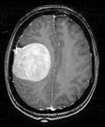

# 🧠 Brain Tumor Classification in MRI Scans

Dieses Projekt beschäftigt sich mit der automatisierten Erkennung von Hirntumoren auf MRT-Bildern mithilfe klassischer Machine-Learning-Algorithmen, Convolutional Neural Networks (CNNs) und Transfer Learning mit MobileNetV2.

---

## 📌 Ziel

Ziel ist es, ein Modell zu entwickeln, das zuverlässig zwischen MRTs **mit Tumor** und **ohne Tumor** unterscheidet. Dabei werden verschiedene Ansätze verglichen:

- Klassische ML-Modelle (Logistische Regression, Random Forest, SVM)
- Eigene CNN-Architektur
- Transfer Learning mit MobileNetV2

---

## 📁 Datensatz

- 📦 **Quelle**: [Brain MRI Images for Brain Tumor Detection (Kaggle)](https://www.kaggle.com/datasets/navoneel/brain-mri-images-for-brain-tumor-detection)
- 🧪 2 Klassen: `yes` (Tumor vorhanden), `no` (kein Tumor)
- 🖼️ Bildergröße: 512×512, einfarbig (teilweise RGB)
- 🔁 Vorverarbeitung:
  - Resize auf 224×224 Pixel
  - Normalisierung (0–1)
  - Label-Encoding (0 = kein Tumor, 1 = Tumor)

---

## 🧮 Verwendete Modelle

### Klassische Machine Learning Modelle

- 📊 **Logistic Regression**
- 🌲 **Random Forest**
- 🧭 **Support Vector Machine (SVM)**

👉 Eingesetzt auf flach vektorisierten Bilddaten (nach Preprocessing)

### Deep Learning

- 🧠 **CNN**: Einfaches Convolutional Neural Network mit Conv2D + MaxPooling
- 🚀 **MobileNetV2**: Vortrainiertes Modell (Transfer Learning, Feature Extraction)

---

## 🧪 Ergebnisse

| Modell             | Test Accuracy |
|--------------------|---------------|
| Logistic Regression | 0.85          |
| Random Forest       | 0.88          |
| SVM                 | 0.86          |
| CNN (eigene Arch.)  | 0.90          |
| MobileNetV2         | **0.93 ✅**   |

---

## 📷 Visuelle Beispiele

Einige Beispielbilder aus dem Datensatz mit zugehörigem Ground Truth Label:

| Tumor vorhanden | Kein Tumor |
|-----------------|------------|
|  |  |

> 🔍 In der erweiterten Version werden zusätzlich Modell-Vorhersagen, falsch klassifizierte Bilder und Aktivierungskarten visualisiert.

---

## 📚 Verwendete Tools

- Python (3.10)
- scikit-learn
- OpenCV
- TensorFlow / Keras
- Matplotlib / Seaborn
- Jupyter Notebook

---

## 🧠 Learnings

- Klassische ML-Modelle liefern eine starke Baseline – besonders bei guter Vorverarbeitung
- CNNs erkennen Bildmuster effizienter und skalieren besser
- Transfer Learning (MobileNetV2) funktioniert selbst mit kleinen Datensätzen sehr gut
- Visuelle Analyse (Fehlklassifikationen, Plots) ist essenziell für Bewertung & Verbesserung

---

## 🛠️ Weiteres geplant

- 📈 Hyperparameter-Tuning für CNNs
- 🧪 Cross Validation
- 💬 Confusion Matrix + Precision/Recall
- 🧠 Grad-CAM (Erklärung der CNN-Vorhersagen)
- 🗃️ Export als `.h5` Modell für Anwendung

---

## ✍️ Autor

**Mitko Valtchev**  
Studium: M.Sc. Computer Engineering – TU Berlin  
Interesse: Machine Learning für medizinische Bildverarbeitung (Imaging AI)

---

## 📎 Lizenz

Dieses Projekt ist zu Lernzwecken öffentlich zugänglich. Bei Verwendung bitte verlinken.

