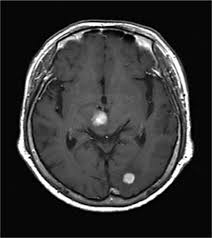

# Brain Tumor Classification

Classifying brain tumors in MRI scans using ML, CNNs, and Transfer Learning (MobileNetV2).

---

## Dataset
- [Kaggle: Brain MRI Images](https://www.kaggle.com/datasets/navoneel/brain-mri-images-for-brain-tumor-detection)
- 2 classes: `yes` / `no`
- Preprocessing: resize (224×224), normalize, label encode

---

## Models & Accuracy
| Model             | Acc  |
|-------------------|------|
| Logistic Regression | 0.85 |
| Random Forest       | 0.88 |
| SVM                 | 0.86 |
| CNN (custom)        | 0.90 |
| MobileNetV2         | **0.93** |

---

## Example Images
| Tumor | No Tumor |
|-------|-----------|
|  |  |

---

## Conclusion
- CNNs outperform classical ML
- Transfer learning works well on small data

